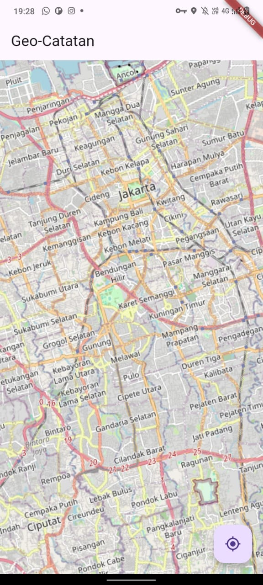
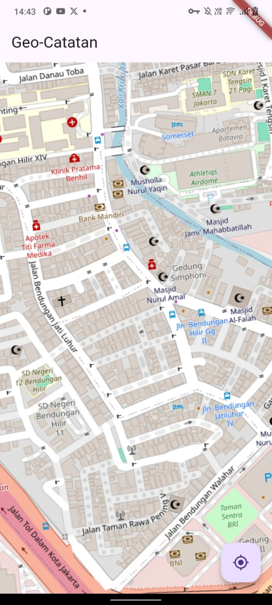

# geo_catatan

A.Membuat Project Baru
flutter create geo_catatan

B.Menambahkan Depedency pada file pubspec.yaml
geolocator: ^11.0.0
geocoding: ^3.0.0
flutter_map: ^6.1.0
latlong2: ^0.9.0
shared_preferences: ^2.2.2

Lalu flutter pub get

4.Pengaturan Permission Android pada 
android/app/src/main/Androidfest.xaml
Tambahkan permission sebelum bagian <application>
<uses-permission android:name="android.permission.ACCESS_FINE_LOCATION" />
<uses-permission android:name="android.permission.ACCESS_COARSE_LOCATION" />
<uses-permission android:name="android.permission.INTERNET" />

5.Membuat model di lib/catatan_model.dart
import 'package:latlong2/latlong.dart';

class CatatanModel {
  final LatLng position;
  final String note;
  final String address;
  final String type;

  CatatanModel({
    required this.position,
    required this.note,
    required this.address,
    required this.type,
  });
  

  // no1
  Map<String, dynamic> toJson() {
    return {
      'lat': position.latitude,
      'long': position.longitude,
      'note': note,
      'address': address,
      'type': type,
    };
  }

  factory CatatanModel.fromJson(Map<String, dynamic> json) {
    return CatatanModel(
      position: LatLng(json['latitude'], json['longitude']), 
      note:json['note'], 
      address: json['address'],
      type: json['type'],
      );
  }
}

Dokumentasi

